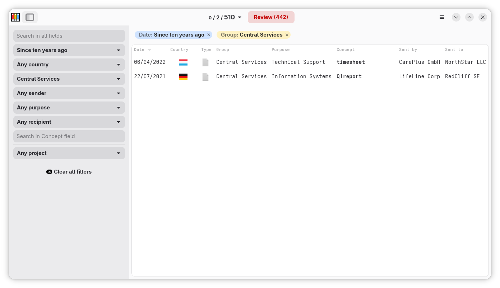
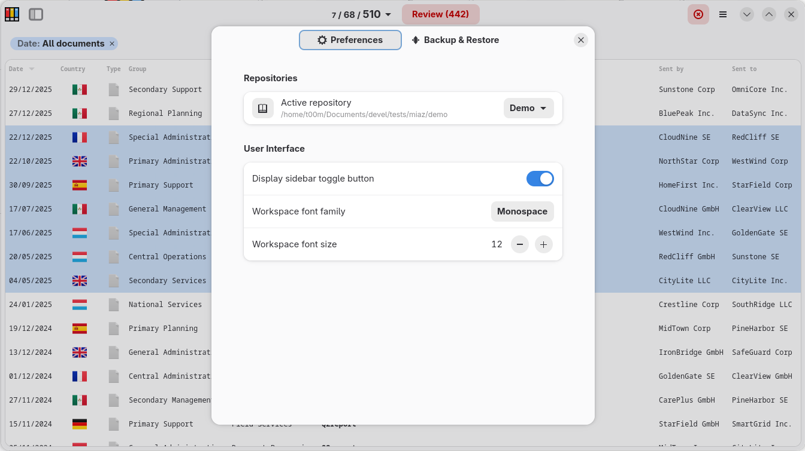
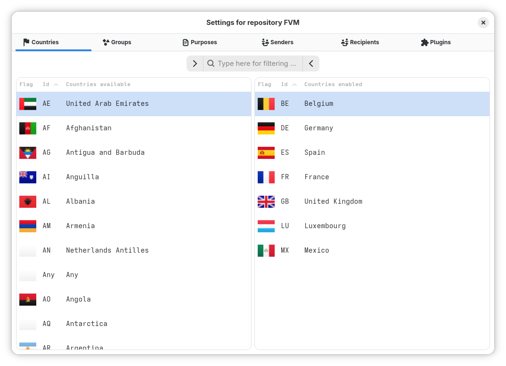
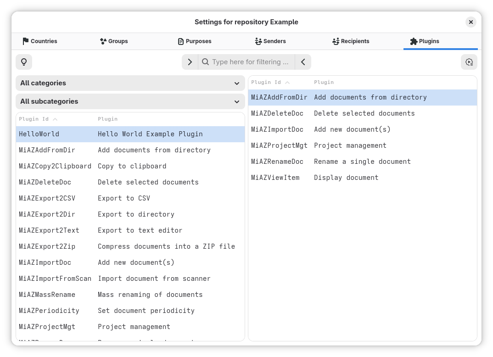

# MiAZ Personal Document Organizer


## About

MiAZ is a personal document organiser for the GNOME desktop. It enforces a strict 7-field filename convention so every document you store is always findable by date, country, group, sender, purpose, concept, and recipient.

Keeping family records, school files, invoices, and administrative paperwork organised is a constant challenge, especially when documents arrive from many different countries and institutions.

There is no database: the directory itself is the database. All metadata lives in the filename, which means
your files are fully portable and readable in any file manager.

MiAZ solves this with a simple, consistent file-naming convention of seven fields. Scan a letter, download an email attachment, drop it into your MiAZ repository, and the app guides you through naming it correctly with minimal effort.


## Features

- **Multiple repositories**: keep work, home, and archive documents separate
- **No database**: the directory is the database; files are always portable
- **Workspace**: fast, filterable list that handles thousands of documents
- **Sidebar filters**: per-field dropdowns for date, country, group, sender, purpose, and recipient
- **Single and mass renaming**: fix one document or rename many at once
- **Project management**: group related documents into named projects
- **Plugin system**: extend functionality with plugins

## File-naming convention

Every document managed by MiAZ follows this seven-field scheme:

```
{date}-{country}-{group}-{sentby}-{purpose}-{concept}-{sentto}
```

| Field | Format | Example |
|---|---|---|
| Date | `%Y%m%d` | `20240315` |
| Country | ISO 3166-1 Alpha-2 | `ES` |
| Group | 3-char code | `HOU`, `FIN`, `EDU` |
| SentBy | Free text (no hyphens) | `BANKNAME` |
| Purpose | 3-char code | `INV`, `REQ`, `INF` |
| Concept | Free text | `Q1invoice` |
| SentTo | Free text (no hyphens) | `JOHNDOE` |

Fields are separated by hyphens. The date-first order means files sort chronologically in any file browser.

## Screenshots









## Installation

### DEB (Debian, Ubuntu, derivatives)

Download the `.deb` package from the [latest release](https://github.com/t00m/MiAZ/releases) and install:

- From file browser: double click the `.deb` package. The Software Manager should let you install it.
- From command line, use `apt` with a path to the file so it resolves and installs every dependency:

```bash
sudo apt install ./miaz_<version>_all.deb
```

The leading `./` matters. It tells `apt` the argument is a local file, not a package name in the repositories. `apt` then pulls the runtime dependencies from the distribution repositories:

```
Installing:
  miaz

Installing dependencies:
  gir1.2-javascriptcoregtk-6.0  gir1.2-webkit-6.0  libpeas-2-common  python3-jaraco.classes  python3-keyring
  gir1.2-peas-2                 libpeas-2-0        python3-gi-cairo   python3-jeepney         python3-secretstorage

Continue? [Y/n]
```

`dpkg -i` does not resolve dependencies, it installs only the package and reports the rest as missing. If you already ran `sudo dpkg -i ./miaz_<version>_all.deb`, fix the missing dependencies with:

```bash
sudo apt-get install -f
```

### RPM (Fedora, RHEL, openSUSE)

Download the `.rpm` package from the [latest release](https://github.com/t00m/MiAZ/releases) and install:

- From file browser: double click the `.rpm` package. The Software Manager should let you install it.
- From command line:

```bash
sudo dnf install ./miaz-*.rpm
```

### Flatpak (deprecated)

Flatpak is no longer provided. The sandbox cannot reach the host command line tools that MiAZ shells out to (`ocrmypdf` for OCR, `scanimage` for the scanner), so those features do not work in a Flatpak build. Use the deb, rpm or AppImage package instead. 

### AppImage

Download the `.AppImage` package from the [latest release](https://github.com/t00m/MiAZ/releases) and install:

- From file browser:
    - Open the file properties and activate the option `Executable as Program`
    - Double click in the `.AppImage` package. MiAZ
- From command line:

```bash
chmod +x ./miaz-*.AppImage
./miaz-*.AppImage
```

### From source

Requirements: Python ≥ 3.9, GTK ≥ 4.10, Libadwaita ≥ 1.6, PyGObject ≥ 3.50, meson, ninja.

```bash
git clone https://github.com/t00m/MiAZ
cd MiAZ
./scripts/install/local/install_user.sh
```

To uninstall:

```bash
./scripts/uninstall/uninstall_user.sh
```

## Command line

Searching works without a display, so it runs over SSH and in scripts.

```bash
miaz repos                                  # repositories, current one marked
miaz search invoice                         # search the current repository
miaz search invoice --repo Work --long      # another one, as a table
miaz search --since last-6-months --json    # structured output
```

Results are one filename per line, so they pipe straight into other tools:

```bash
miaz search --since this-month | xargs -d '\n' ls -lh
miaz search --json | jq -r '.[].concept'
```

Filters map onto the same fields the workspace sidebar uses: `--country`,
`--group`, `--sentby`, `--purpose`, `--sentto`, `--concept`, `--since` or
`--from` and `--to`, `--pending`, `--all` and `--limit`.

Exit codes: 0 results, 1 no results, 2 wrong arguments, 3 repository problem.
Set `MIAZ_DEBUG=1` to see the usual logging.

Running `miaz` with no arguments opens the window as always.

## Requirements

- Debian 13.5
- Last Ubuntu LTS
- Last Fedora

| Dependency | Minimum version |
|---|---|
| Python | 3.9 |
| GTK | 4.10 |
| Libadwaita | 1.6 |
| PyGObject | 3.50 |

## Contributing

Bug reports and feature requests: [GitHub Issues](https://github.com/t00m/MiAZ/issues)

## About the author

My name is Tomás Vírseda. Originally from Spain, currently working in Luxembourg as (SAP Basis) System Adminstrator/Consultant and living in Germany. Having fun with Linux and Free Software/Software Libre since 1997.

Feel free to reach out: tomasvirseda@gmail.com

## About AI usage in this app

First public commit of this application started in September, 2022. It's been improved from time to time until 2026.
Because of lack of time (work and family), I was about to stop the development.

On April, 2026 I had a chance to test AI capabilities. In a few minutes, it solved a big performance issue that I was unable to determine. Since then, I've used to fix many other issues (plugin integrations and other core stuff).
Check CLAUDE.md and AGENTS.md for more info.

## License

GPL v3 (see [data/docs/LICENSE](data/docs/LICENSE)).

## Disclaimer

* **This software application is currently in development and is not yet ready for production use**. The application may contain bugs, errors, or other issues that could cause your computer or device to malfunction or experience other unexpected behaviors. By using this application, you acknowledge and agree that you do so at your own risk, and that the developer and any other parties involved in the development, distribution, or support of this application are not responsible for any damages or losses that may result from its use.*

* **This software application performs typical file operations (such as copy, rename, delete) at Operating System level**. Make sure you have a backup of those files.

* Be aware that files added to the repository directory, are **automatically renamed** to comply with MiAZ rules.

* Please note that **this application is based on the GPL v3 license**, and is provided free of charge. There is **no guarantee of any kind**, either express or implied, regarding its functionality, reliability, or suitability for any particular purpose. The developer reserves the right to modify, update, or discontinue this application at any time, and may not provide support or assistance in resolving any issues or problems that arise from its use. However, **you are free to grab, extend, improve and fork the code as you want**.
