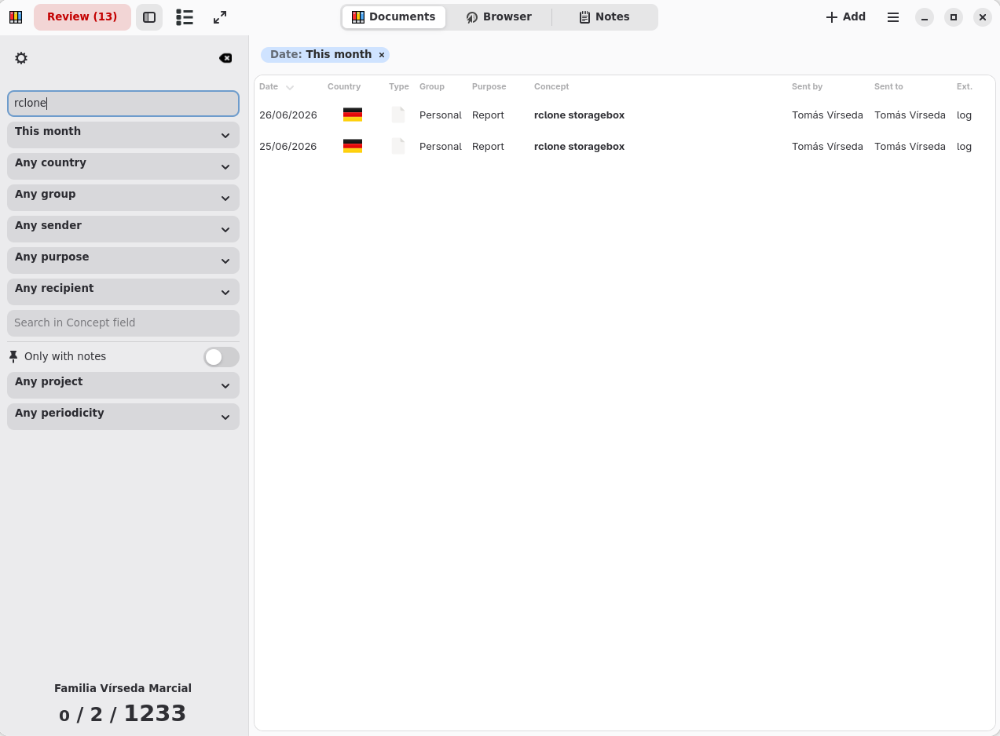

<div align="center">

<picture>
  <!-- A dark variant can be added here as a second <source> without touching
       anything else: put it at data/docs/brand/io.github.t00m.MiAZ-brand-dark.png
       and add a media="(prefers-color-scheme: dark)" source above this one. -->
  <source media="(prefers-color-scheme: light)" srcset="data/docs/brand/io.github.t00m.MiAZ-brand.png">
  
</picture>

# MiAZ Personal Document Organizer

**"Consistent names. Effortless order."**

A Linux desktop application that files personal paperwork under a strict seven-field.

<p>
  <a href="https://github.com/t00m/MiAZ/actions/workflows/ci.yml"></a>
  <a href="https://github.com/t00m/MiAZ/releases/latest"></a>
  <a href="data/docs/LICENSE"></a>
</p>
<p>
  
  
  
  
</p>

</div>

> [!WARNING]
> Any file you drop into a MiAZ repository directory is **renamed automatically** to
> the seven-field shape. Point MiAZ at a copy of your documents until you trust it,
> and keep a backup either way.

## About

MiAZ is a **personal document organiser** for Linux desktops.

Keeping family records, school files, invoices, and administrative paperwork organised is a constant challenge, especially when documents arrive from many different countries and institutions.

MiAZ solves this with a simple, consistent file-naming convention. Scan a letter, download an email attachment, drop it into your MiAZ repository, and the app guides you through naming it correctly with minimal effort.

It enforces a strict 7-field filename convention so every document you store is always findable by date, country, group, sender, purpose, concept, and recipient.

There is no database: the directory itself is the database. All metadata lives in the filename, which means
your files are fully portable and readable in any file manager.


## Features

Out of the box core capabilities:

**The repository**

- **No database**: the directory is the database. All metadata lives in the filename, so your files stay readable in any file manager and portable to any machine
- **Multiple repositories**: keep work, home and archive documents apart, and switch between them without restarting. Vocabularies and enabled plugins belong to the repository, not to the app

**Getting documents in**

- **Drag and drop**: drop files from the file manager onto the document list. Drop a folder and MiAZ asks whether its subfolders count, telling you how many files each answer imports
- **Add menu**: pick one file or many (`Ctrl+Insert`), or a whole directory (`Shift+Insert`), which asks the same question about subfolders. Either way the document is copied in, never moved, and normalised to the seven-field shape. A big import runs in the background, with one refresh at the end instead of one per file

**Filing them**

- **Review queue**: documents that do not match the convention yet are listed apart, so filing is a task you can finish
- **Read from the document**: the date comes out of the file's own metadata, and country, sender and recipient out of its text, with `pdftotext` or OCR when there is no text layer. Values are matched against vocabulary the repository already has, so a guess is never something invented
- **Single and mass renaming**: fix one document, or set any of the seven fields across a whole selection at once
- **Duplicate detection**: review marks a document whose bytes match another one, so a copy already filed can be discarded without opening it

**Finding them again**

- **Workspace**: a filterable list that stays fast as the repository grows
- **Sidebar filters**: one dropdown per field, for date, country, group, sender, purpose and recipient, with the active ones shown as chips you can click off
- **Search**: type in the search box and the list narrows as you type

**Keeping them**

- **Backup and restore**: back up the documents, the configuration or the whole repository, and restore any of them, from the application settings


Beyond that, [several plugins](#plugins) ship with the app, and you can write your own.


## File-naming convention

Every document managed by MiAZ follows this seven-field scheme:

```
{date}-{country}-{group}-{sentby}-{purpose}-{concept}-{sentto}
```

| Field | Format | Example |
|---|---|---|
| Date | `%Y%m%d` | `20240315` |
| Country | ISO 3166-1 Alpha-2 | `ES` |
| Group | 3-char code | `HOU`, `FIN`, `EDU` |
| SentBy | Free text (no hyphens) | `BANKNAME` |
| Purpose | 3-char code | `INV`, `REQ`, `INF` |
| Concept | Free text | `Q1invoice` |
| SentTo | Free text (no hyphens) | `JOHNDOE` |

Fields are separated by hyphens. The date-first order means files sort chronologically in any file browser.

### Renaming many at once

Select two or more documents and the rename button becomes a menu with seven functions: date, country, group, purpose, concept, sent by and sent to. Each one previews every new name before it touches the disk.

The date function detects a date per file by default, and says how many it managed to read. The concept function is a guided transform: keep or remove tokens, add a prefix or suffix, find and replace, change case, or set a value outright.

## Screenshots

<div align="center">
<picture>
  <source media="(prefers-color-scheme: light)" srcset="data/docs/screenshots/MiAZ-Worskpace.png">
  
</picture>
<br><em>The workspace. Every document, filterable by any of the seven fields.</em>
</div>

<details>
<summary><b>More screenshots</b> (filters, plugins, settings)</summary>
<br>
<div align="center">

<picture>
  
</picture>
<br><em>Sidebar filters: one dropdown per field.</em>
<br><br>

<picture>
  
</picture>
<br><em>Plugins are enabled per repository, not globally.</em>
<br><br>

<picture>
  
</picture>
<br><em>Repository settings: vocabularies for each field.</em>
<br><br>

<picture>
  
</picture>
<br><em>Application settings.</em>

</div>
</details>

## Installation

### DEB (Debian, Ubuntu, derivatives)

Download the `.deb` package from the [latest release](https://github.com/t00m/MiAZ/releases) and install:

- From file browser: double click the `.deb` package. The Software Manager should let you install it.
- From command line, use `apt` with a path to the file so it resolves and installs every dependency:

```bash
sudo apt install ./miaz_<version>_all.deb
```

`apt` then pulls the runtime dependencies from the distribution repositories:


### RPM (Fedora, RHEL, openSUSE)

Download the `.rpm` package from the [latest release](https://github.com/t00m/MiAZ/releases) and install:

- From file browser: double click the `.rpm` package. The Software Manager should let you install it.
- From command line:

```bash
sudo dnf install ./miaz-*.rpm
```

### Flatpak (deprecated)

> [!WARNING]
> No Flatpak is published. The sandbox cannot reach the host command line tools MiAZ
> shells out to (`ocrmypdf` for OCR, `scanimage` for the scanner), so those features do
> not work in a Flatpak build. Use the deb, rpm or AppImage package instead. The
> manifest and build scripts are kept in the tree as a legacy option.

### AppImage

Download the `.AppImage` package from the [latest release](https://github.com/t00m/MiAZ/releases) and install:

- From file browser:
    - Open the file properties and activate the option `Executable as Program`
    - Double click in the `.AppImage` package. MiAZ
- From command line:

```bash
chmod +x ./miaz-*.AppImage
./miaz-*.AppImage
```

### From source

Requirements: Python ≥ 3.9, GTK ≥ 4.10, Libadwaita ≥ 1.7, PyGObject ≥ 3.50, meson, ninja.

```bash
git clone https://github.com/t00m/MiAZ
cd MiAZ
./scripts/install/local/install_user.sh
```

To uninstall:

```bash
./scripts/uninstall/uninstall_user.sh
```

## Plugins

Plugins are not part of the core: nothing below is needed to file a document. They
are enabled **per repository**, from the repository settings, so a work repository
can scan and export while a personal one stays plain. Switching repository unloads
the plugins of the one you leave and loads the ones the new one enables.

Seventeen ship with the app.

**More ways in**

| Plugin | What it does |
|---|---|
| MiAZImportFromZip | Add the documents inside a ZIP file |
| MiAZImportFromScan | Scan a document and import it |
| MiAZAutoScan | Scan in the background and import straight into the repository |

**Ways out**

| Plugin | What it does |
|---|---|
| MiAZExport2Dir | Copy the selected documents to a directory |
| MiAZExport2Zip | Compress the selection into a ZIP file |
| MiAZExport2CSV | Write the selection's fields as CSV, for a spreadsheet |
| MiAZExport2Text | Open the selection in a text editor |

**More than a filename**

| Plugin | What it does |
|---|---|
| MiAZProjectMgt | Group related documents under a project, and filter the workspace by it. The assignment lives in `projects.json`, never in the filename |
| MiAZNotes | Markdown notes attached to a document, edited and previewed in the app |
| MiAZPeriodicity | Record how often a document is expected: monthly, yearly, on demand |

**Reading the document for you**

| Plugin | What it does |
|---|---|
| MiAZOCR | Run OCR over a PDF and keep the text as a note, so a scan becomes searchable |
| MiAZAIAssistant | Ask an AI provider to suggest the filename fields. Your own key, your own choice of provider |

**Looking at the whole collection**

| Plugin | What it does |
|---|---|
| MiAZInsights | Totals, a per-year trend, a month-by-year activity heatmap and a world map of where your paperwork comes from |

**The window itself**

| Plugin | What it does |
|---|---|
| MiAZColumnVisibility | Show and hide workspace columns |
| MiAZWSFont | Change the workspace font and size |
| MiAZFullscreen | Toggle fullscreen |

> [!NOTE]
> Some plugins need Python packages MiAZ does not depend on, the AI providers in
> particular. The **External libraries** group in the application settings installs
> them into a private virtualenv in your home directory, **never** into the system
> Python. MiAZOCR also needs `ocrmypdf`, and MiAZAutoScan needs `scanimage`, from your
> distribution.

**Writing your own:** `HelloWorld` is a working example to copy and start from. Your own plugins go in `~/.MiAZ/opt/plugins/`, and can be imported as a ZIP from the plugin settings.

## Requirements

| Dependency | Minimum version |
|---|---|
| Python | 3.9 |
| GTK | 4.10 |
| Libadwaita | 1.7 |
| PyGObject | 3.50 |

Tested on current Ubuntu LTS 26.04, and the current Fedora (v44).


## Contributing

Bug reports and feature requests: [GitHub Issues](https://github.com/t00m/MiAZ/issues)


## About the author

My name is Tomás Vírseda. Originally from Spain, currently working in Luxembourg as (SAP Basis) System Adminstrator/Consultant and living in Germany. Having fun with Linux and Free Software/Software Libre since 1997.

Feel free to reach out: tomasvirseda@gmail.com

## About AI usage in this app

First public commit of this application started in September, 2022. It's been improved from time to time until 2026.
Because of lack of time (work and family), I was about to stop the development.

On April, 2026 I had a chance to test AI capabilities. In a few minutes, it solved a big performance issue that I was unable to determine. Since then, I've used to fix many other issues (plugin integrations and other core stuff) and give shape my ideas.
Check AGENTS.md for more info.

This decision has also led to the application being banned from the Flathub repositories. The fact that it is not easy to use external utilities has also contributed to the lack of support for Flatpak.

## License

GPL v3 (see [data/docs/LICENSE](data/docs/LICENSE)).

## Disclaimer

> [!CAUTION]
> MiAZ performs real file operations (copy, rename, delete) on your documents, and
> renames anything placed in a repository directory automatically. It is still in
> development. Keep a backup.

* **This software application is currently in development and is not yet ready for production use**. The application may contain bugs, errors, or other issues that could cause your computer or device to malfunction or experience other unexpected behaviors. By using this application, you acknowledge and agree that you do so at your own risk, and that the developer and any other parties involved in the development, distribution, or support of this application are not responsible for any damages or losses that may result from its use.*

* **This software application performs typical file operations (such as copy, rename, delete) at Operating System level**. Make sure you have a backup of those files.

* Be aware that files added to the repository directory, are **automatically renamed** to comply with MiAZ rules.

* Please note that **this application is based on the GPL v3 license**, and is provided free of charge. There is **no guarantee of any kind**, either express or implied, regarding its functionality, reliability, or suitability for any particular purpose. The developer reserves the right to modify, update, or discontinue this application at any time, and may not provide support or assistance in resolving any issues or problems that arise from its use. However, **you are free to grab, extend, improve and fork the code as you want**.
