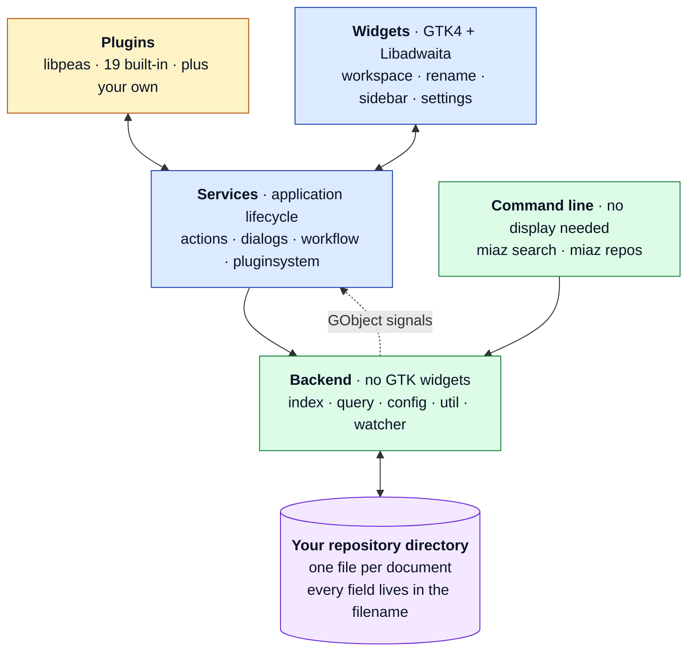
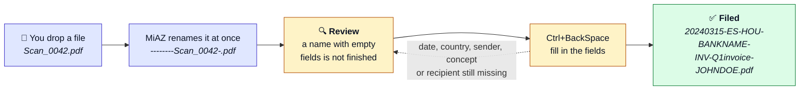

<div align="center">

<picture>
  <!-- A dark variant can be added here as a second <source> without touching
       anything else: put it at data/docs/brand/io.github.t00m.MiAZ-brand-dark.png
       and add a media="(prefers-color-scheme: dark)" source above this one. -->
  <source media="(prefers-color-scheme: light)" srcset="data/docs/brand/io.github.t00m.MiAZ-brand.png">
  
</picture>

# MiAZ Personal Document Organizer

**Your documents, named so well you never need to search for them.**

A GNOME desktop application that files personal paperwork under a strict seven-field
filename. No database, no index to rebuild, no lock-in: the directory *is* the database.

<p>
  <a href="https://github.com/t00m/MiAZ/actions/workflows/ci.yml"></a>
  <a href="https://github.com/t00m/MiAZ/releases/latest"></a>
  <a href="data/docs/LICENSE"></a>
</p>
<p>
  
  
  
  
</p>

</div>

> [!WARNING]
> Any file you drop into a MiAZ repository directory is **renamed automatically** to
> the seven-field shape. Point MiAZ at a copy of your documents until you trust it,
> and keep a backup either way.

## About

MiAZ is a personal document organiser for the GNOME desktop. It enforces a strict 7-field filename convention so every document you store is always findable by date, country, group, sender, purpose, concept, and recipient.

Keeping family records, school files, invoices, and administrative paperwork organised is a constant challenge, especially when documents arrive from many different countries and institutions.

There is no database: the directory itself is the database. All metadata lives in the filename, which means
your files are fully portable and readable in any file manager.

MiAZ solves this with a simple, consistent file-naming convention of seven fields. Scan a letter, download an email attachment, drop it into your MiAZ repository, and the app guides you through naming it correctly with minimal effort.

## Features

- **No database**: the directory is the database; files are always portable
- **Multiple repositories**: keep work, home, and archive documents separate, and switch between them without restarting
- **Workspace**: fast, filterable list that handles thousands of documents
- **Sidebar filters**: per-field dropdowns for date, country, group, sender, purpose, and recipient
- **Review queue**: documents that do not match the convention yet are listed apart, so filing is a task you can finish
- **Automatic date detection**: reads the date out of the document instead of guessing
- **Single and mass renaming**: fix one document, or set a field across a whole selection
- **Projects**: group related documents under a name
- **Notes**: keep Markdown notes attached to a document
- **Command line**: search the repository without a display
- **Plugins**: 19 built-in, plus your own

## How it fits together

The layering has one rule behind it: the backend never touches a GUI toolkit, so
everything that decides *what* happens can run, and be tested, without a display.
That is what makes `miaz search` possible over SSH.



> [!NOTE]
> The command line never imports GTK, and never reaches into the desktop frontend.
> That is not a convention anybody has to remember: `tests/test_boundaries.py` fails
> the build if it happens.

## File-naming convention

Every document managed by MiAZ follows this seven-field scheme:

```
{date}-{country}-{group}-{sentby}-{purpose}-{concept}-{sentto}
```

| Field | Format | Example |
|---|---|---|
| Date | `%Y%m%d` | `20240315` |
| Country | ISO 3166-1 Alpha-2 | `ES` |
| Group | 3-char code | `HOU`, `FIN`, `EDU` |
| SentBy | Free text (no hyphens) | `BANKNAME` |
| Purpose | 3-char code | `INV`, `REQ`, `INF` |
| Concept | Free text | `Q1invoice` |
| SentTo | Free text (no hyphens) | `JOHNDOE` |

Fields are separated by hyphens. The date-first order means files sort chronologically in any file browser.

## How filing works

Drop a file into the repository directory. MiAZ notices it and renames it to the seven-field shape straight away, leaving every field empty except the concept, which keeps the original filename. The document then shows up under **Review**, because a name with empty fields is not a finished name.



Open it with `Ctrl+BackSpace` and fill in the fields. The dialog refuses to enable **Rename** until date, country, sender, concept and recipient make a valid name. Group and purpose are advisory: it warns, it does not block.

### Where the date comes from

Typing a date for every document is the slowest part of filing, so MiAZ reads one where it can. It tries two sources, in order:

1. **The document's own metadata.** PDF `CreationDate` and the XMP packet, EXIF `DateTimeOriginal` for photos, and the creation date inside Word, Excel and OpenDocument files. No extra Python package is needed for any of this.
2. **The filename**, which is where the original name is kept after import. Only dates whose field order the text settles by itself are read: `2024-03-15` and `15_03_2024` are read, `03_04_2024` is not, because it is 3 April in most of the world and 4 March in the United States and nothing in the name says which.

> [!NOTE]
> When neither source has an answer the date becomes **`99991231`**, on purpose. It is
> a real date, so nothing downstream needs a special case, and it sorts last, so
> documents with an unknown date gather at the end of the workspace instead of hiding
> among documents genuinely filed today.

The file modification time is never used. A bank statement downloaded today has today's mtime, which says when you downloaded it, not when it was written.

> [!TIP]
> The date row in the rename dialog has a button that reads the date again on demand.
> Useful after correcting the concept, or for a document already filed under a wrong date.

### Renaming many at once

Select two or more documents and the rename button becomes a menu with seven functions: date, country, group, purpose, concept, sent by and sent to. Each one previews every new name before it touches the disk.

The date function detects a date per file by default, and says how many it managed to read. The concept function is a guided transform: keep or remove tokens, add a prefix or suffix, find and replace, change case, or set a value outright.

## Screenshots

<div align="center">
<picture>
  <source media="(prefers-color-scheme: light)" srcset="data/docs/screenshots/MiAZ-Worskpace.png">
  
</picture>
<br><em>The workspace. Every document, filterable by any of the seven fields.</em>
</div>

<details>
<summary><b>More screenshots</b> (filters, plugins, settings)</summary>
<br>
<div align="center">

<picture>
  
</picture>
<br><em>Sidebar filters: one dropdown per field.</em>
<br><br>

<picture>
  
</picture>
<br><em>Plugins are enabled per repository, not globally.</em>
<br><br>

<picture>
  
</picture>
<br><em>Repository settings: vocabularies for each field.</em>
<br><br>

<picture>
  
</picture>
<br><em>Application settings.</em>

</div>
</details>

## Installation

### DEB (Debian, Ubuntu, derivatives)

Download the `.deb` package from the [latest release](https://github.com/t00m/MiAZ/releases) and install:

- From file browser: double click the `.deb` package. The Software Manager should let you install it.
- From command line, use `apt` with a path to the file so it resolves and installs every dependency:

```bash
sudo apt install ./miaz_<version>_all.deb
```

> [!IMPORTANT]
> The leading `./` matters. It tells `apt` the argument is a local file rather than a
> package name in the repositories.

`apt` then pulls the runtime dependencies from the distribution repositories:

```
Installing:
  miaz

Installing dependencies:
  gir1.2-javascriptcoregtk-6.0  gir1.2-webkit-6.0  libpeas-2-common  python3-jaraco.classes  python3-keyring
  gir1.2-peas-2                 libpeas-2-0        python3-gi-cairo   python3-jeepney         python3-secretstorage

Continue? [Y/n]
```

> [!CAUTION]
> `dpkg -i` does not resolve dependencies. It installs the package alone and reports
> the rest as missing. If you already ran `sudo dpkg -i ./miaz_<version>_all.deb`,
> repair it with the command below.

```bash
sudo apt-get install -f
```

### RPM (Fedora, RHEL, openSUSE)

Download the `.rpm` package from the [latest release](https://github.com/t00m/MiAZ/releases) and install:

- From file browser: double click the `.rpm` package. The Software Manager should let you install it.
- From command line:

```bash
sudo dnf install ./miaz-*.rpm
```

### Flatpak (deprecated)

> [!WARNING]
> No Flatpak is published. The sandbox cannot reach the host command line tools MiAZ
> shells out to (`ocrmypdf` for OCR, `scanimage` for the scanner), so those features do
> not work in a Flatpak build. Use the deb, rpm or AppImage package instead. The
> manifest and build scripts are kept in the tree as a legacy option.

### AppImage

Download the `.AppImage` package from the [latest release](https://github.com/t00m/MiAZ/releases) and install:

- From file browser:
    - Open the file properties and activate the option `Executable as Program`
    - Double click in the `.AppImage` package. MiAZ
- From command line:

```bash
chmod +x ./miaz-*.AppImage
./miaz-*.AppImage
```

### From source

Requirements: Python ≥ 3.9, GTK ≥ 4.10, Libadwaita ≥ 1.7, PyGObject ≥ 3.50, meson, ninja.

```bash
git clone https://github.com/t00m/MiAZ
cd MiAZ
./scripts/install/local/install_user.sh
```

To uninstall:

```bash
./scripts/uninstall/uninstall_user.sh
```

## Command line

Searching works without a display, so it runs over SSH and in scripts.

```bash
miaz repos                                  # repositories, current one marked
miaz search invoice                         # search the current repository
miaz search invoice --repo Work --long      # another one, as a table
miaz search --since last-6-months --json    # structured output
```

Results are one filename per line, so they pipe straight into other tools:

```bash
miaz search --since this-month | xargs -d '\n' ls -lh
miaz search --json | jq -r '.[].concept'
```

Filters map onto the same fields the workspace sidebar uses: `--country`,
`--group`, `--sentby`, `--purpose`, `--sentto`, `--concept`, `--since` or
`--from` and `--to`, `--pending`, `--all` and `--limit`.

Values for `--since`: `this-month`, `past-month`, `last-3-months`,
`last-6-months`, `last-12-months`, `2-years`, `3-years`, `5-years`, `10-years`,
`future`.

Exit codes: 0 results, 1 no results, 2 wrong arguments, 3 repository problem.
Set `MIAZ_DEBUG=1` to see the usual logging.

`--repo` reads another repository without changing which one the window opens
next time.

Running `miaz` with no arguments opens the window as always.

## Keyboard shortcuts

| Shortcut | Action |
|---|---|
| `Ctrl+BackSpace` | Rename the selected document |
| `Ctrl+Delete` | Delete the selected documents |
| `Return` | View the selected document |
| `Ctrl+Insert` | Import documents |
| `Ctrl+s` | Settings |
| `Ctrl+?` | Keyboard shortcuts |
| `Ctrl+b` | About |
| `Ctrl+q` | Quit |
| `F1` | Help |

## Plugins

Plugins are enabled per repository, from the repository settings. Switching repository unloads the plugins of the one you leave and loads the ones the new one enables. Nineteen ship with the app:

| Plugin | What it does |
|---|---|
| MiAZAddFromDir | Add documents from a directory |
| MiAZImportFromScan | Import a document from a scanner |
| MiAZAutoScan | Scan in the background and import straight into the repository |
| MiAZImportFromZip | Import documents from a ZIP file |
| MiAZExport2CSV | Export to CSV |
| MiAZExport2Dir | Export to a directory |
| MiAZExport2Text | Export to a text editor |
| MiAZExport2Zip | Compress documents into a ZIP file |
| MiAZCopy2Clipboard | Copy to clipboard |
| MiAZProjectMgt | Group documents into projects |
| MiAZPeriodicity | Set how often a document is expected |
| MiAZNotes | Markdown notes attached to a document |
| MiAZInsights | Charts and a world map over your documents |
| MiAZOCR | Extract text from PDFs with OCR and save it as a note |
| MiAZAIAssistant | Suggest filename fields from the document content |
| MiAZColumnVisibility | Show and hide workspace columns |
| MiAZWSFont | Change the workspace font |
| MiAZFullscreen | Toggle fullscreen |
| HelloWorld | Example plugin to start from |

> [!NOTE]
> Some plugins need Python packages MiAZ does not depend on, the AI providers in
> particular. The **External libraries** group in the application settings installs
> them into a private virtualenv in your home directory, **never** into the system
> Python. MiAZOCR also needs `ocrmypdf`, and MiAZAutoScan needs `scanimage`, from your
> distribution.

Your own plugins go in `~/.MiAZ/opt/plugins/`, and can be imported as a ZIP from the plugin settings.

## Requirements

| Dependency | Minimum version | Why this floor |
|---|---|---|
| Python | 3.9 | the oldest interpreter the code is written against |
| GTK | 4.10 | `Gtk.FileDialog`, `Gtk.FontDialog` |
| Libadwaita | 1.7 | `Adw.InlineViewSwitcher`, built with the main window |
| PyGObject | 3.50 | |

Tested on Debian 13, the current Ubuntu LTS, and the current Fedora.

> [!WARNING]
> Ubuntu 24.04 LTS ships libadwaita 1.5 and MiAZ will refuse to start on it, saying so
> rather than crashing. Ubuntu 25.10 and later, and Debian 13, are fine.

## Contributing

Bug reports and feature requests: [GitHub Issues](https://github.com/t00m/MiAZ/issues)

Tests:

```bash
python -m pytest tests/ --ignore=tests/ui   # unit tests, no display needed
./scripts/checks/run_ui_tests.sh            # drives the real application
```

`tests/manual/UI-CHECKLIST.md` covers what a machine cannot judge, and is the release gate.

> [!TIP]
> The unit tests need no display and run in seconds. The UI suite starts the real
> application against a throwaway repository and takes several minutes, so run the one
> file that covers your change while you work:
> `./scripts/checks/run_ui_tests.sh tests/ui/test_ui_rename.py`

## About the author

My name is Tomás Vírseda. Originally from Spain, currently working in Luxembourg as (SAP Basis) System Adminstrator/Consultant and living in Germany. Having fun with Linux and Free Software/Software Libre since 1997.

Feel free to reach out: tomasvirseda@gmail.com

## About AI usage in this app

First public commit of this application started in September, 2022. It's been improved from time to time until 2026.
Because of lack of time (work and family), I was about to stop the development.

On April, 2026 I had a chance to test AI capabilities. In a few minutes, it solved a big performance issue that I was unable to determine. Since then, I've used to fix many other issues (plugin integrations and other core stuff).
Check CLAUDE.md and AGENTS.md for more info.

## License

GPL v3 (see [data/docs/LICENSE](data/docs/LICENSE)).

## Disclaimer

> [!CAUTION]
> MiAZ performs real file operations (copy, rename, delete) on your documents, and
> renames anything placed in a repository directory automatically. It is still in
> development. Keep a backup.

* **This software application is currently in development and is not yet ready for production use**. The application may contain bugs, errors, or other issues that could cause your computer or device to malfunction or experience other unexpected behaviors. By using this application, you acknowledge and agree that you do so at your own risk, and that the developer and any other parties involved in the development, distribution, or support of this application are not responsible for any damages or losses that may result from its use.*

* **This software application performs typical file operations (such as copy, rename, delete) at Operating System level**. Make sure you have a backup of those files.

* Be aware that files added to the repository directory, are **automatically renamed** to comply with MiAZ rules.

* Please note that **this application is based on the GPL v3 license**, and is provided free of charge. There is **no guarantee of any kind**, either express or implied, regarding its functionality, reliability, or suitability for any particular purpose. The developer reserves the right to modify, update, or discontinue this application at any time, and may not provide support or assistance in resolving any issues or problems that arise from its use. However, **you are free to grab, extend, improve and fork the code as you want**.
